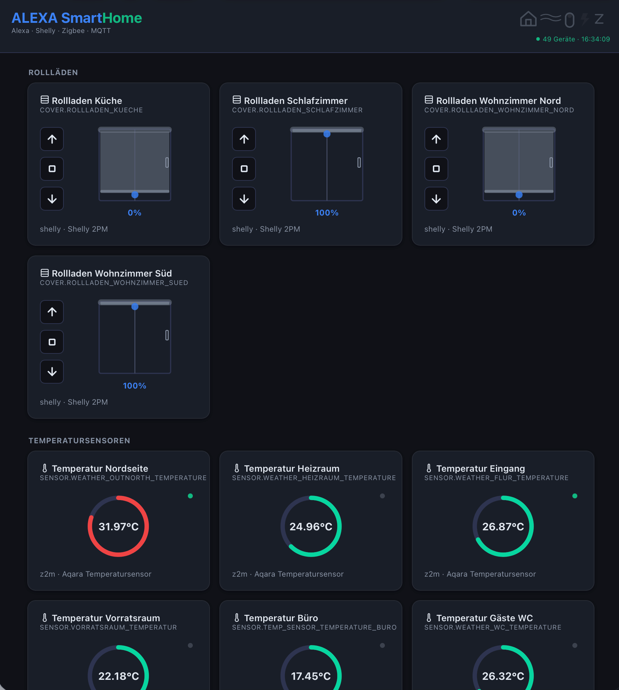

[](https://github.com/zibous/hc_alexa/releases)
[](https://github.com/zibous/hc_alexa)
[](https://python.org)
[](https://fastapi.tiangolo.com)
[](https://hub.docker.com)
[](https://mqtt.org)
[](#)
[](#)
[](#)
[](#)
[](https://www.buymeacoff.ee/zibous)

# hc_alexa – Smart Home Alexa Controller

Standalone Smart Home Skill ohne HomeAssistant.  
Steuert Geräte direkt per HTTP (Shelly/ESPHome) und MQTT (Zigbee2MQTT/Tasmota).



## Architektur

```
┌─────────────────────────────────────────────────────────────────────┐
│                         AMAZON CLOUD                                │
│                                                                     │
│   Alexa Echo ──→ Alexa Service ──→ Smart Home Skill ──→ AWS Lambda  │
│                                                                     │
└──────────────────────────────────────────┬──────────────────────────┘
                                           │ HTTPS POST (JSON)
                                           ▼
┌─────────────────────────────────────────────────────────────────────┐
│                         LOKALES NETZWERK                            │
│                                                                     │
│   ┌──────────┐     ┌────────────────┐     ┌─────────────────────┐   │
│   │  Nginx   │────▶│  hc_alexa      │────▶│  Geräte             │   │
│   │  (SSL)   │     │  FastAPI :5018 │     │                     │   │
│   │  :443    │◀────│                │◀────│  Shelly (HTTP)      │   │
│   └──────────┘     │  Dashboard     │     │  Zigbee (MQTT/z2m)  │   │
│                    │  Alexa API     │     │  ESPHome (HTTP)     │   │
│                    │  KPI API       │     │  Tasmota (MQTT)     │   │
│                    └────────────────┘     └─────────────────────┘   │
│                                                                     │
└─────────────────────────────────────────────────────────────────────┘
```

## Datenfluss Detail

```
ALEXA BEFEHL: "Alexa, Rollladen Küche auf 50%"

  ┌──────────┐    ┌─────────┐    ┌──────────┐    ┌────────────┐    ┌────────┐
  │  Alexa   │───▶│  AWS    │───▶│  Nginx   │───▶│  FastAPI   │───▶│ Shelly │
  │  Echo    │    │  Lambda │    │  :443    │    │  :5018     │    │ HTTP   │
  │          │◀───│         │◀───│          │◀───│            │◀───│        │
  └──────────┘    └─────────┘    └──────────┘    └────────────┘    └────────┘
       🗣️             ☁️              🔒              🐍              💡
   "Ok, erledigt"   Python       SSL Termination   Alexa Handler    Gerät

ALEXA FRAGE: "Alexa, wie warm ist es in der Küche?"

  Alexa ──▶ Lambda ──▶ Nginx ──▶ FastAPI ──▶ StatusCache (MQTT/Z2M)
    ◀── "25.3 Grad" ◀── JSON ◀── StateReport ◀── weather-kitchen: 25.3°C
```

## Alexa StateReport – Echtzeit-Temperaturwerte

Alexa fragt regelmäßig (ca. alle 60 Sekunden) den Status aller Geräte per `ReportState` ab.
Die Antwort muss als **`StateReport`** formatiert sein (nicht `Response`), damit Alexa die Werte korrekt übernimmt.

Wichtig: Die `endpointId` in der Antwort muss exakt dem Format der Anfrage entsprechen (mit `#`-Trennzeichen), sonst kann Alexa die Antwort nicht zuordnen und zeigt veraltete Werte an.

### StateReport pro Gerätetyp

| Gerätetyp | Alexa Properties |
|-----------|-----------------|
| `sensor` | `TemperatureSensor.temperature` |
| `thermostat` | `ThermostatController.targetSetpoint` + `thermostatMode` + `TemperatureSensor.temperature` |
| `switch` / `light` / `dimmer` | `PowerController.powerState` |
| `roller` | `RangeController.rangeValue` |

Jede Antwort enthält zusätzlich `EndpointHealth.connectivity = OK`.

## Protokolle

| Protokoll | Zugriff | Status-Abruf | Beispiel |
|-----------|---------|--------------|----------|
| `shelly` | HTTP GET `http://{ip}/relay/{ch}?turn=on` | HTTP GET Status | Rollläden, Schalter, Dimmer |
| `z2m` | MQTT `{Z2M_TOPIC_BASE}/{topic_id}/set` | Z2M state.json + MQTT Live | Sensoren, Thermostate |
| `esphome` | HTTP POST `http://{ip}/{endpoint_on}` | HTTP GET `http://{ip}/{endpoint_status}` | Türöffner |
| `mqtt` | MQTT Publish auf `topic` | MQTT Subscribe auf `topic_id` | Tasmota Schalter/Sensoren |
| `midea` | LAN via msmart-ng (proprietary) | Geräte-Status abfragen | Midea/Comfee Klimaanlage |
| `miio` | LAN via python-miio (MIoT) | Geräte-Status abfragen | Xiaomi Air Purifier |

## Geräte-Konfiguration (devices.yaml)

```yaml
- id: rollladen_kueche          # Alexa Endpoint-ID
  name: "Rollladen Küche"       # Alexa friendly name
  type: roller                   # switch, dimmer, light, roller, thermostat, sensor
  category: INTERIOR_BLIND      # Alexa Display Category
  protocol: shelly              # shelly, z2m, esphome, mqtt
  ip: "10.1.1.160"             # Nur bei HTTP-Geräten
  channel: "0"                  # Nur bei Shelly
  topic_id: null               # MQTT Topic für Status (bei z2m: friendly_name)
  topic: null                  # MQTT Topic für Befehle (bei mqtt-Protokoll)
  value_path: null             # JSON-Pfad bei verschachtelter Payload
  unit: null                   # Einheit (°C, m³) – null = °C
  alexa: true                  # false = nur Dashboard, kein Alexa
  hardware: "Shelly 2PM"
```

## Projektstruktur

```
hc_alexa/
├── app/
│   ├── api/
│   │   ├── alexa_router.py        POST /api/alexa/smart_home
│   │   ├── alexa_admin.py         Admin: Token-Status, Delete-Devices, Compare
│   │   ├── oauth_router.py        OAuth2 Account Linking für Alexa Skill
│   │   ├── dashboard_router.py    GET /api/devices, POST /api/control
│   │   └── kpi_router.py          GET /api/kpidata
│   ├── config/
│   │   ├── settings.py            Pydantic Settings aus .env
│   │   └── logging_config.py
│   ├── core/
│   │   └── device_loader.py       Lädt devices.yaml (cached, hot-reload)
│   ├── infrastructure/
│   │   ├── mqtt_client.py         Persistenter MQTT Publisher
│   │   ├── status_cache.py        Z2M State + MQTT Live-Updates + ChangeReport Trigger
│   │   ├── midea_client.py        Midea Gerätesteuerung (Klimaanlage)
│   │   └── miio_client.py         Xiaomi Mi Home / miIO Gerätesteuerung
│   ├── models/
│   │   └── device.py              DeviceConfig Pydantic Model
│   ├── processor/
│   │   ├── alexa_processor.py     Routing: Discovery/Control/State + endpointId Handling
│   │   ├── handlers/
│   │   │   ├── discovery.py       Alexa.Discovery Handler (proactivelyReported: false)
│   │   │   ├── control.py         Power/Brightness/Position/Thermostat
│   │   │   └── state.py           StateReport (alle Gerätetypen)
│   │   └── helpers.py
│   ├── schemas/
│   │   └── kpi.py
│   ├── services/
│   │   ├── change_report.py       Proaktive ChangeReports an Alexa Event Gateway
│   │   ├── kpi_service.py
│   │   └── access_log.py
│   └── main.py
├── data/
│   ├── devices.yaml               Geräte-Konfiguration
│   ├── z2m_state.json             Z2M State (via sync_z2m.sh)
│   └── z2m_config.yaml            Z2M Config (via sync_z2m.sh)
├── frontend/static/
│   ├── index.html
│   ├── css/                        Modulares CSS (11 Dateien + Bundles)
│   └── js/                         Modulares JS (13 Dateien + Bundles)
├── scripts/
│   └── sync_z2m.sh               Z2M-Daten per SCP holen
├── aws/
│   ├── alexa-smart-home-skill/    Lambda für hc SmartHome Skill
│   └── HA_ALEXA.py               Lambda für Homeassistant Skill
├── Dockerfile
├── docker-compose.yml
├── Makefile
├── requirements.txt
└── .env
```

## API Endpoints

| Endpoint | Methode | Beschreibung |
|----------|---------|--------------|
| `/api/alexa/smart_home` | POST | Alexa Smart Home Directive Endpoint |
| `/api/devices` | GET | Dashboard: Alle Geräte mit Status |
| `/api/control` | POST | Dashboard: Gerät steuern |
| `/api/kpidata` | GET | KPI-Daten für Übersichts-Dashboard |
| `/api/debug/cache` | GET | Roher MQTT-Cache (Entwicklung) |
| `/api/admin/token-status` | GET | Alexa Token und ChangeReport Status |
| `/api/admin/compare-devices` | GET | Vergleich devices.yaml vs. Alexa |
| `/api/admin/delete-devices` | POST | Geräte bei Alexa entfernen (DeleteReport) |
| `/oauth/authorize` | GET | OAuth2 Authorization (Account Linking) |
| `/oauth/token` | POST | OAuth2 Token Exchange |
| `/health` | GET | Health-Check |

## Makefile Befehle

```bash
make dev              # Lokaler Dev-Server mit Auto-Reload
make sync-z2m         # Z2M State-Dateien vom Remote holen
make up               # Docker starten (mit Z2M-Sync)
make down             # Docker stoppen
make restart          # Docker restart (mit Z2M-Sync)
make rebuild          # Docker neu bauen + starten (no-cache)
make build            # Docker bauen + starten
make logs             # Docker Logs verfolgen
make logs-tail        # Letzte 100 Log-Zeilen
make ps               # Laufende Container anzeigen
make jsbuild          # Frontend JS/CSS bundeln (esbuild via Docker)
make jsclean          # Bundle-Dateien entfernen
make check-syntax     # AST Syntax-Check aller Python-Dateien
make check-config     # docker-compose.yml Syntax prüfen
make check-build      # Docker Build Trockenlauf
make install          # pip install -r requirements.txt
make test-discovery   # Alexa Discovery simulieren
make test-power-on    # Schalter einschalten testen
make test-power-off   # Schalter ausschalten testen
make test-roller      # Rollladen Position testen
make test-dimmer      # Dimmer Helligkeit testen
make test-thermostat  # Thermostat setzen testen
make test-sensor      # Temperatur abfragen testen
make test-esphome     # ESPHome Türöffner testen
make test-dashboard   # Dashboard API testen
make test-health      # Health-Check
make git-setup        # Forgejo Remote einrichten
make git-update       # Git Push zu Forgejo
make git-release      # Neues Version-Tag erstellen + pushen
```

---

## AWS Lambda einrichten

### 1. Lambda-Funktion erstellen

AWS Console → Lambda → Funktion erstellen:
- Name: `alexa-smart-home-skill`
- Runtime: Python 3.12
- Architektur: arm64 (günstiger)

### 2. Lambda-Code

```python
"""AWS Lambda Handler für Alexa Smart Home Skill."""
import os, json, urllib3

def lambda_handler(event, context):
    base_url = os.environ.get('BASE_URL', '').strip("/")
    verify_ssl = not bool(os.environ.get('NOT_VERIFY_SSL'))

    http = urllib3.PoolManager(
        cert_reqs='CERT_REQUIRED' if verify_ssl else 'CERT_NONE',
        timeout=urllib3.Timeout(connect=2.0, read=10.0)
    )

    response = http.request(
        'POST',
        f'{base_url}/api/alexa/smart_home',
        headers={'Content-Type': 'application/json'},
        body=json.dumps(event).encode('utf-8'),
    )

    if response.status >= 400:
        return {'event': {'payload': {'type': 'INTERNAL_ERROR',
                'message': response.data.decode("utf-8")}}}

    return json.loads(response.data.decode('utf-8'))
```

### 3. Lambda-Konfiguration
- Timeout: **10 Sekunden** (Alexa erlaubt max 8s)
- Memory: **128 MB** (reicht für URL-Forward)
- Umgebungsvariablen: `BASE_URL=https://<domain>/`
- Trigger: Wird vom Alexa Skill hinzugefügt

---

## Alexa Smart Home Skill erstellen

### 4. Skill in der Alexa Developer Console

1. Öffne https://developer.amazon.com/alexa/console/ask
2. **Create Skill**
   - Name: `hc SmartHome`
   - Locale: `German (DE)`
   - Type: **Smart Home**
   - Hosting: **Provision your own**
3. **Smart Home Service Endpoint**
   - Default endpoint: ARN deiner Lambda-Funktion

### 5. Account Linking

Unter "Account Linking" konfigurieren:
- Authorization URI: `https://<domain>/oauth/authorize`
- Access Token URI: `https://<domain>/oauth/token`
- Client ID: `alexa-smarthome`
- Scope: `smarthome`

### 6. Lambda Trigger

AWS Console → Lambda → Trigger hinzufügen:
- Trigger: **Alexa Smart Home**
- Skill ID: `amzn1.ask.skill.xxx-xxx-xxx`

---

## Alexa App: Skill aktivieren

1. Alexa App → **Mehr → Skills & Spiele → Deine Skills → Entwickler**
2. Skill aktivieren + Account Linking durchführen
3. "Alexa, suche meine Geräte"
4. Alle Geräte aus `devices.yaml` erscheinen

### Testen

```
"Alexa, suche nach neuen Geräten"
"Alexa, Rollladen Küche auf 50 Prozent"
"Alexa, schalte Gartenbrunnen ein"
"Alexa, wie warm ist es in der Küche?"
"Alexa, stelle Heizung Bad auf 22 Grad"
"Alexa, schalte Heizung Bad auf Heizen"
```

---

## Nginx-Konfiguration

```nginx
# Alexa Smart Home Endpoint (AWS Lambda → FastAPI)
set $alexa_backend "http://localhost:5018";

location /api/alexa/smart_home {
    proxy_pass $alexa_backend$request_uri;
    proxy_set_header Host $host;
    proxy_set_header X-Real-IP $remote_addr;
    proxy_set_header Authorization $http_authorization;
}

# OAuth Endpoints für Account Linking
location /oauth/ {
    proxy_pass $alexa_backend;
    proxy_set_header Host $host;
}

# Dashboard (Browser)
location ^~ /dashboardalexa/ {
    proxy_pass http://10.1.1.119:5018/;
}
```

---

## Umgebungsvariablen (.env)

```env
MQTT_HOST=10.1.1.198
MQTT_PORT=4883
MQTT_USER=smarthome
MQTT_PASS=********
MQTT_KEEPALIVE=60
Z2M_TOPIC_BASE=conbee2mqtt
OAUTH_CLIENT_ID=alexa-smarthome
OAUTH_TOKEN=smarthome-alexa-token-2026
DEVICES_YAML_PATH=data/devices.yaml
```

---

## Status-Daten Synchronisation

```
┌──────────────┐    SCP beim Start      ┌──────────────┐
│  NUC2020     │ ──────────────────────▶│  hc_alexa    │
│  Z2M Server  │    state.json          │  data/       │
│              │    configuration.yaml  │              │
└──────────────┘                        └──────┬───────┘
                                               │
                    MQTT Live-Updates          │ Liest beim Start
                    (conbee2mqtt/#)            ▼
┌──────────────┐                        ┌──────────────┐
│  EMQX        │ ──────────────────────▶│  StatusCache │
│  Broker      │    Thermostat/Sensor   │  (Memory)    │
│  :4883       │    Änderungen          │              │
└──────────────┘                        └──────────────┘
```

---

## Bekannte Einschränkungen

- **Proaktive ChangeReports** erfordern ein LWA (Login with Amazon) Refresh Token. Aktuell pollt Alexa per StateReport (ca. alle 60s). Für Echtzeit-Push muss "Send Alexa Events" in der Developer Console aktiviert werden.
- **Skill-Wechsel** führt zum Verlust aller Raum-Zuordnungen und Routinen in der Alexa App. Geräte bleiben als "Geister" erhalten auch nach Skill-Deaktivierung.
- **Namenskonflikte** bei Sensoren und Thermostaten im gleichen Raum (z.B. "Temperatur Gästezimmer 1" vs. "Heizung Gästezimmer 1") – Lösung: Eindeutige Namen oder Alexa-Raum-Zuordnung nutzen.

> [!IMPORTANT]
> **Lizenz & Kommerzielle Nutzung (Commercial Use)**
> Dieses Projekt ist für die **private, nicht-kommerzielle Nutzung** sowie für Fehlerkorrekturen (Pull Requests) völlig kostenlos. 
> 
> 🚫 **Eine kommerzielle Nutzung ist strikt untersagt.** 
> Wenn Sie diesen Code geschäftlich, in einem Unternehmen oder für ein monetarisiertes Projekt nutzen möchten, benötigen Sie eine separate Lizenz.
> 
> 📧 **Kontakt für kommerzielle Lizenzen:** peter.siebler@gmail.com